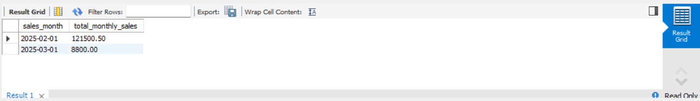

# E-commerce SQL Analytics Project (MySQL)

## Introduction

This project demonstrates a relational database schema for an e-commerce platform using MySQL. It includes table creation, sample data insertion, and basic analytical queries to showcase SQL skills in schema design and data retrieval.

## Technologies Used

* *Database:* MySQL
* *Tool:* MySQL Workbench

## Schema

The database consists of the following tables:

* customers: Stores customer information.
* categories: Stores product categories.
* products: Stores product details, linked to categories.
* orders: Stores customer order headers.
* order_items: Stores individual items within each order (linking orders and products).


## How to Use

1.  *Create Database:* Connect to your MySQL server and run:
    sql
    CREATE DATABASE ecommerce_analytics;
    USE ecommerce_analytics;
    
2.  *Create Tables:* Execute the entire script schema.sql to create the table structures and indexes.
3.  *Insert Sample Data:* Execute the entire script data.sql to populate the tables with sample records.
4.  *Run Queries:* Execute the queries found in queries.sql individually to see the analysis results based on the sample data.

## Sample Queries

Here is an example of one of the queries included in queries.sql:

*1. Calculate Total Sales Amount Per Month:*
```sql
-- Query 1: Calculate Total Sales Amount Per Month
SELECT
    DATE_FORMAT(o.order_date, '%Y-%m-01') AS sales_month,
    SUM(oi.quantity * oi.price_per_unit) AS total_monthly_sales
FROM orders o
JOIN order_items oi ON o.order_id = oi.order_id
WHERE o.status NOT IN ('Cancelled', 'Pending')
GROUP BY sales_month
ORDER BY sales_month;
```

Output:

